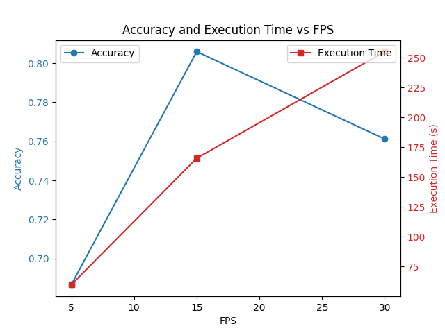

# Basketball Shot Detection

This project is designed to detect and count basketball shots, distinguishing between successful and unsuccessful attempts. It utilizes an object detection model, specifically YOLO (You Only Look Once), to track basketballs and hoops in a video feed. The primary goal is to determine when a basketball enters the hoop area, indicating a potential shot attempt, and then assess whether the shot was made based on subsequent ball movement.

## Requirements

To use this project, you'll need:

- Python 3.x
- OpenCV (`cv2`)
- NumPy
- Ultralytics' YOLO object detection library

## Usage

### Running the Detector

Instantiate the `Shot_Detector` class with the necessary parameters:

- `source`: Path to the video source.
- `output_path`: Path to save the resulting video.
- `detection_fps`: Number of frames per second to process for object detection.
- `display_object_info`: Boolean flag to display information about detected objects.

Use the `.run()` method to run the detection algorithm, and it will return the makes and attempts detected.

### Example

```python
from shot_detector import Shot_Detector

detector = Shot_Detector(source="path/to/video.mp4", output_path="path/to/output", detection_fps=30, display_object_info=True)
makes, attempts = detector.run()
print(f"Successful shots: {makes}/{attempts}")
```

## Algorithm Details

The algorithm used to detect shots and makes was inspired by https://github.com/avishah3/AI-Basketball-Shot-Detection-Tracker, but his algorithm lacked the ability to make correct detections with multiple balls and hoops in the camera. I vastly improved this algorithm by adding multiple ball and hoop support, as well as efficiency options. The main idea of the algorithm is to detect when a ball is within the hoop area through detecting the hoop with a YOLOv8 trained model, then calculating the backboard area of the hoop. If a ball is detected in this area, it is considered a shot. Once that ball has gone below that area, a line is created from the last point it was above the rim, to the first point it is below the rim. If this line goes between the ends of the rim, it is considered a make. 

### Object Detection

I used universe.roboflow.com to find a dataset that contained basketball and hoop detections and trained a YOLOv8 model on this dataset.

### Ball and Hoop Tracking

To track multiple balls and hoops in a video feed, I created a list that contained a lists of dictionaries for each sepereate ball/hoop detected. Each dictionary contained information about the detection of the object detected: center of the object, frame it was detected, and the confidence of the detection. To determine if a detection belonged with an already detected ball/hoop, the euclidian distance between the center of the currently detected object and the last frame of the already detected objected. For balls, if this distance was less than 2 * hypotenuse of previous detections box size, or if the ball was in the hoop area, less than 4 * hypotenuse of previous detections box, then it is added to that balls list. For hoops the process is the same, except the hypotenuse is not multiplied by a factor. This is because balls can move more distance between frames than hoops should, furthermore balls can sometimes not be detected when it is shot and around the rim, which is why the scaling is more when a ball is around the hoop area.

### Shot Detection

When a ball is detected around the area of a hoop, the ball and hoop is added to a list called `up_ball`, and a shot attempt is added. Once a ball in the `up_ball` list is detected to be below the hoop it is associated with, a line is created with the position of the ball before it was below the rim, and the first position it is below the rim. If the line goes between the ends of the rim a make is added, else a make is not added. See https://github.com/avishah3/AI-Basketball-Shot-Detection-Tracker for a visualization of this algorithm.

### Efficiency

Each frame takes a significant time to be put through the object detection model, so to decrease execution time I added a `detection_fps` parameter. This parameter control how many frames a second is ran through the algorithm. Choosing a low `detection_fps` such as 5 will significantly decrease runtime, but will also decrease accuracy. 

## Accuracy



This plot shows the execution time and accuracy at 30, 15, 5 `detection_fps`. Each was tested on 67 individual shot clips. Decreasing the `detection_fps` to 15 significantly decreases execution time, while slightly increasing accuracy.

## Example Output

https://github.com/josephattalla/Basketball-Shot-Detection/assets/121779512/0e18408a-1be4-46b9-bd21-09b5b5d00f2d

## Conclusion

I learned a lot of valuable lessons in this project. When I first started, I used many different neural network models such as CNN, RCNN, masked RCNN, but found no success with any of them. After some research I found a much better approach than just pushing data into neural networks and hoping it will learn from them, but rather utilizing machine learning to gain insights about the data and using those insights to make inferences about what has happened. I also learned how to take a concept and create a solution that isn't just functional but also highly usable and efficient.


