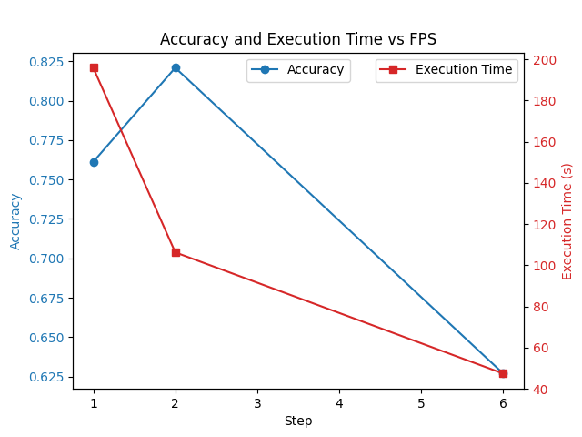

# Basketball Shot Detection

This project is designed to detect and count basketball shots, distinguishing between successful and unsuccessful attempts. It utilizes an object detection model, specifically YOLO (You Only Look Once), to track basketballs and hoops in a video feed. The primary goal is to determine when a basketball enters the hoop area, indicating a potential shot attempt, and then assess whether the shot was made based on subsequent ball movement.

## Requirements

To use this project, you'll need:

- Python 3.x
- OpenCV (`cv2`)
- NumPy
- Ultralytics' YOLO object detection library

## Usage

### Running the Detector

Instantiate the `Shot_Detector` class with the necessary parameters:

- `source`: Path to the video source.
- `output_path`: Path to save the resulting video.
- `step`: Process every step frame.
- `display_object_info`: Boolean flag to display information about detected objects.
- `model`: Path to YOLO detection model.
- `verbose`: YOLO verbose parameter

Use the `.run()` method to run the detection algorithm, and it will return the makes and attempts detected.

### Example

```python
from shot_detector import Shot_Detector

detector = Shot_Detector(source="path/to/video.mp4", output_path="path/to/output", step=1, display_object_info=True, model="path/to/detection.pt", verbose=False)
makes, attempts = detector.run()
print(f"Successful shots: {makes}/{attempts}")
```

## Algorithm Details

The algorithm used to detect shots and makes was inspired by https://github.com/avishah3/AI-Basketball-Shot-Detection-Tracker, but his algorithm lacked the ability to make correct detections with multiple balls and hoops in the camera. I vastly improved this algorithm by adding multiple ball and hoop support, as well as efficiency options. The main idea of the algorithm is to detect when a ball is within the hoop area through detecting the hoop with a YOLOv8 trained model, then calculating the backboard area of the hoop. If a ball is detected in this area, it is considered a shot. Once that ball has gone below that area, a line is created from the last point it was above the rim, to the first point it is below the rim. If this line goes between the ends of the rim, it is considered a make. 

### Object Detection

The algorithm employs YOLOv8 to detect basketballs and hoops. The detection model is trained on a dataset containing basketball and hoop detections obtained from universe.roboflow.com. The object detection model identifies hoops and balls in each frame of the video.

### Ball and Hoop Tracking

To track multiple balls and hoops, two classes are used: DetectedObject and DetectedBall. The DetectedObject class holds information about each detected object, including its center, size, and confidence. The DetectedBall class extends this functionality to manage multiple detections of the same ball.

Objects are tracked based on the Euclidean distance between their centers. For balls, if this distance is less than 2 times the hypotenuse of the previous detection's bounding box or if the ball is in the hoop area with a confidence greater than 0.3, it is considered the same ball. For hoops, the distance check is not scaled because hoops are expected to be more stable compared to balls.

### Shot Detection

The algorithm determines shot attempts by detecting if a ball is in the hoop's backboard area. The ball-hoop pair is added to the `up_ball` list if the ball is detected within the hoop's backboard area. Once a ball from this list is detected below the hoop, a line is calculated from the last detection above the hoop to the first detection below the hoop. If this line goes between the rim, the shot is considered a make.

### Efficiency

To optimize execution time, the `step` parameter controls how frequently frames are processed. Lower values of `step` result in fewer frames being processed, which decreases runtime but may also affect accuracy.

## Accuracy



This plot shows the execution time and accuracy with `step` set at 1, 2, and 6. Each was tested on 67 individual shot clips. Increasing the `step` to 2 significantly decreases execution time, while slightly increasing accuracy.

## Example Output

*ran with `step = 2`*

https://github.com/josephattalla/Basketball-Shot-Detection/assets/121779512/0e18408a-1be4-46b9-bd21-09b5b5d00f2d

## Conclusion

I learned a lot of valuable lessons in this project. When I first started, I used many different neural network models such as CNN, RCNN, masked RCNN, but found no success with any of them. After some research I found a much better approach than just pushing data into neural networks and hoping it will learn from them, but rather utilizing machine learning to gain insights about the data and using those insights to make inferences about what has happened. I also learned how to take a concept and create a solution that isn't just functional but also highly usable and efficient.
